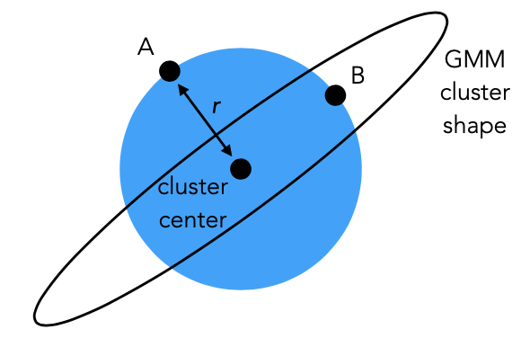

<a name="top"></a>

# 95-865: Unstructured Data Analytics


## Links
[95-865: Unstructured Data Analytics (Spring 2024 Mini 4)](https://www.andrew.cmu.edu/user/georgech/95-865/)


## Course Outline

### Part I: Exploratory Data Analysis
Identify structure present in "unstructured" data

- Frequency and co-occurrence analysis
- Visualizing high-dimensional data/dimensionality reduction
- Clustering
- Topic modeling

### Part II: Predictive Data Analysis
Make predictions using known structure in data

- Basic concepts and quality assessment of prediction models
- Neural networks and deep learning for analyzing texts and image


## Table of Contents
- [Lecture 1. Overview](#lecture-1-overview)
- [Lecture 2. Basic Text Analysis](#lecture-2-basic-text-analysis)
- [Lecture 3. Basic Text Analysis, Co-occurrence Analysis](#lecture-3-basic-text-analysis-co-occurrence-analysis)
- [Lecture 4. Co-occurrence Analysis](#lecture-4-co-occurence-analysis)
- [Lecture 5. PCA](#lecture-5-pca)
- [Lecture 6. Manifold Learning](#lecture-6-manifold-learning)
- [Lecture 7. Clustering](#lecture-7-clustering)
- [Lecture 8. Clustering II](#lecture-8-clustering)
- [Lecture 8. Topic Modeling](#lecture-9-topic-modeling)

[Back to Top](#)

---


## Lecture 1. Overview

### Types of Data

1. **Structured data**: Well-defined elements, relationships between elements

2. **Unstructured data**: No pre-defined model; elements and relationships are ambiguous
    - Text
    - Images
    - Videos
    - Audio

### UDA Process - Solving a "murder mystery"
1. Question
2. Data/Evidence
3. Finding Structure: Exploratory data analysis
4. Insights: Answer original question


### Bag of Words (BoW) Model
- **Bag of Words (BoW) model** represents text data as a collection of words without considering the order.
    - Uses raw count frequency to represent the occurrence of words
- **Corpus**: a large and structured collection of text documents.
- **Collection Term Frequency (CTF)** refers to the frequency of a term across an entire collection of documents in a corpus.


#### Properties of Text
1. Split on blank spaces
2. Stopwords typically do not carry significant semantic meaning
    - Remove stopwords or not?


[Back to Top](#)

---


## Lecture 2. Basic Text Analysis


### NLP Tasks

For capitalization or words in various forms:

- **Lemmatization** reduces words to the base or canonical form, known as the lemma, while still preserving the meaning.

For words with multiple meanings:

- **Word Sense Disambiguation (WSD)** determines the correct meaning or sense of a word within a given context.

For named entities:

- **Named Entity Recognition (NER)** identifies and categorizes named entities within text data into predefined categories such as persons, organizations, locations, dates, quantities, and etc.

Other common tasks:

- **Tokenization** breaks down a text into smaller units, called tokens, which can be words, phrases, symbols, or other meaningful elements.

- **Part-of-speech (POS) tagging** assigns a part-of-speech tag to each word in a text based on syntactic role and grammatical category within a sentence, including nouns, verbs, adjectives, adverbs, pronouns, conjunctions, prepositions, and interjections.

- **Sentence boundary detection** (sentence recognition) determines where one sentence ends and the next begins in a given text.


### Bigram Model

**Bigram model** is a probabilistic language model that predicts the probability of a word given the previous word in a sequence of words.

Similarly,

- Consecutive 1 word at a time: **Unigram model**

- Consecutive 3 words at a time: **Trigram model**

- Consecutive $n$ words at a time: **N-gram model**


### Demo: BoW Model (Dictionaries/Counter)

[Jupyter notebook (basic text analysis)](https://gist.github.com/georgehc/932764d81cd246a60b85e28648cf05bc)

#### Load spaCy model
```python
import spacy
nlp = spacy.load('en_core_web_sm')  # Load spaCy's built-in English model (tokenizer, tagger, parser, NER, and word vectors)
```

#### Processing
```python
parsed_text = nlp(text)
```

#### Display tokens
```python
for token in parsed_text:
    """
    Display the token's orthographic representation, lemma, part of speech, and entity type (empty if not part of a named entity)
    """
    print(token, token.lemma_, token.pos_, token.ent_type_)
```

Output
```
The the DET 
opioid opioid ADJ 
epidemic epidemic NOUN 
or or CCONJ 
opioid opioid ADJ 
crisis crisis NOUN 
is be AUX 
the the DET 
rapid rapid ADJ 
increase increase NOUN 
in in ADP 
the the DET 
```

```python
type(token)         # spacy.tokens.token.Token
token               # .
token == '.'        # False
token.orth_ == '.'  # True
str(token) == '.'   # True
token.pos_          # 'PUNCT'
token.lemma_        # '.'
```


Note:
- `_` means the string representation
- After the for loop, `token` will point to the last element from the parsed text, which is a period (`.`)


#### Iterate through named entities
```python
for entity in parsed_text.ents:
    print(entity, entity.label_)
```

#### Iterate through the sentences
```python
idx = 0
for sentence in parsed_text.sents:
    print('Sentence number', idx, ':', sentence)
    idx += 1

for idx, sentence in enumerate(parsed_text.sents):
    print('Sentence number', idx, ':', sentence)
```

#### Count each token

```python
histogram = {}
for token in parsed_text:
    if token.orth_ not in histogram:
        histogram[token.orth_] = 1
    else:
        histogram[token.orth_] += 1

# Convert to a list of tuples
list(histogram.items())

from operator import itemgetter
sorted_token_count_pairs = sorted(histogram.items(),
                                  reverse=True, # Sort in reverse order (largest to smallest)
                                  key=itemgetter(1)) # lambda x: x[1]
```

Alternative: `Counter.most_common()`

```python
from collections import Counter

histogram = Counter()
for token in parsed_text:
    histogram[token.orth_] += 1

sorted_token_count_pairs = histogram.most_common()
for token, count in sorted_token_count_pairs:
    print(token, ":", count)
```


#### Remove stopwords, punctuations, and spaces
```python
from collections import Counter

histogram_with_filtering = Counter()
for token in parsed_text:
    lemma = token.lemma_.lower() # Convert lemma to lowercase
    # Ignore junk
    if not (nlp.vocab[lemma].is_stop or token.pos_ == 'PUNCT' or token.pos_ == 'SPACE' or token.pos_ == 'X'):
        histogram_with_filtering[lemma] += 1

sorted_lemma_count_pairs = histogram_with_filtering.most_common()
for lemma, count in sorted_lemma_count_pairs:
    print(lemma, ":", count)
```


#### Manually remove stopwords
```python
manual_stop_words = {'jump', 'b', '-', 'c'} # Create a set

# Keep lemma that are not the stopwords
histogram_filtered_twice = Counter({lemma: count
                                    for lemma, count in histogram_with_some_filtering.items()
                                    if lemma not in manual_stop_words})

twice_filtered_sorted_lemma_count_pairs = histogram_filtered_twice.most_common()
for lemma, count in twice_filtered_sorted_lemma_count_pairs:
    print(lemma, ":", count)
```


#### Plot top 20 most frequently occurring lemmas
```python
%matplotlib inline
import matplotlib.pyplot as plt

num_top_lemmas_to_plot = 20
top_lemmas = [lemma for lemma, count in twice_filtered_sorted_lemma_count_pairs[:num_top_lemmas_to_plot]]
top_counts = [count for lemma, count in twice_filtered_sorted_lemma_count_pairs[:num_top_lemmas_to_plot]]
plt.bar(range(num_top_lemmas_to_plot), top_counts)
plt.xticks(range(num_top_lemmas_to_plot), top_lemmas, rotation=90)
plt.xlabel('Lemma')
plt.ylabel('Raw count')
```

### Summary
- Models such as BoW and bigram models represent each document as a histogram/probability distribution
- **Feature vector**: vector representation of the document
    - Feature vectors are high-dimensional where $dimensions = number of terms$


[Back to Top](#)

---


## Lecture 3. Basic Text Analysis, Co-occurrence Analysis

### Demo: BoW Model (Arrays/Vectors)

[Jupyter notebook (basic text analysis using arrays)](https://gist.github.com/georgehc/7c7fac867821b5ab4db84107c38b591a)  

- Identify all the distinct tokens and record the index of initial occurrences
- Represent each term as a "one-hot" encoded vector
- Sum up all the vectors which results in a single raw count vector of the entire text


#### OHE Representation
```python
import numpy as np

one_hot_encoded_vectors = []
for token in parsed_text:
    word = token.orth_

    one_hot_encoded_vector = np.zeros(vocab_size)  # all zeros; length of vector is the vocabulary size
    one_hot_encoded_vector[word_to_idx[word]] = 1  # Set the current word's index to 1

    one_hot_encoded_vectors.append(one_hot_encoded_vector)

one_hot_encoded_vectors = np.array(one_hot_encoded_vectors)  # Convert list of 1D arrays into NumPy 2D array
```

#### Counts

```python
raw_counts = one_hot_encoded_vectors.sum(axis=0) # Sum columns

sorted(zip(raw_counts, vocab), reverse=True) 
```


### Co-occurrence Analysis

**Co-occurrence analysis** identifies and analyzes patterns of co-occurrence between terms or entities within a corpus of text.

Methodologies:

1. Rank using co-occurence probability $P(A, B)$ may be misleading
2. **Pointwise Mutual Information (PMI)** is used to quantify the strength of the association between two terms in a corpus of text.

$$ PMI(A, B) = \log \left( \frac{P(A, B)}{P(A) \cdot P(B)} \right) $$

- If $PMI = 0$, A and B are independent, $P(A, B) = P(A) \cdot P(B)$
- If $PMI$ more positive value -> A & B co-occur much more likely than if they were independent
- If $PMI$ more negative value -> A & B co-occur much less likely than if they were independent
- For pairs that rarely occured, $P(A, B) = 0$, $\log 0$ is undefined ($-\infty$)


3. Jaccard index
$$J(A, B) = \frac{|A \cap B|}{|A \cap B|} = \frac{P(A, B)}{P(A) + P(B) - P(A, B)}$$


### Demo: Co-occurence Analysis

[Jupyter notebook (co-occurrence analysis toy example)](https://gist.github.com/georgehc/fc4d54e525ba9c76325cdc7d468ccb28)

#### Rank using co-occurence probability $P(A, B)$

```python
from collections import Counter
co_occurrence_probabilities = Counter()
for person, company in all_pairs:
    count = 0
    for doc in docs:
        if person in doc and company in doc:
            count += 1
    co_occurrence_probabilities[(person, company)] = count / len(docs)
```

#### Rank using $PMI$

```python
people_probabilities = Counter()
for person in people:
    count = 0
    for doc in docs:
        if person in doc:
            count += 1
    people_probabilities[person] = count / len(docs)
print(people_probabilities)
```

Output
```
Counter({'Elon Musk': 0.596, 'Sundar Pichai': 0.04564, 'Lisa Su': 0.03048})
```

```python
company_probabilities = Counter()
for company in companies:
    count = 0
    for doc in docs:
        if company in doc:
            count += 1
    company_probabilities[company] = count / len(docs)
print(company_probabilities)
```

Output
```
Counter({'Tesla': 0.53772, 'AMD': 0.102, 'Alphabet': 0.09868})
```


```python
from math import log  # natural log
pmi_scores = Counter()
for person, company in all_pairs:
    ratio = co_occurrence_probabilities[(person, company)] / (people_probabilities[person] * company_probabilities[company])
    pmi_scores[(person, company)] = log(ratio)

pmi_scores.most_common()
```

Output
```
[(('Lisa Su', 'AMD'), 2.2246972677322665),
 (('Sundar Pichai', 'Alphabet'), 2.2027896706816303),
 (('Elon Musk', 'Tesla'), 0.515280473364625),
 (('Elon Musk', 'AMD'), 0.38700386263618614),
 (('Sundar Pichai', 'AMD'), 0.34906758973637103),
 (('Elon Musk', 'Alphabet'), 0.33721775717105734),
 (('Lisa Su', 'Alphabet'), 0.28509661762242633),
 (('Sundar Pichai', 'Tesla'), 0.060801512460662566),
 (('Lisa Su', 'Tesla'), 0.03891009097880922)]
```


[Back to Top](#)

---


## Lecture 4. Co-occurence Analysis

### N-gram

The distribution of the next character given L characters:

$$
P(B|A) = \frac{P(A, B)}{P(A)}
= \frac{\# \text{ seq. of } L + 1 \text{ consecutive characters equal to } A \text{ followed by } B}{\# \text{ seq. of } L + 1 \text{ consecutive characters starting with } A}
$$


### Demo: Co-occurrences Analysis at Character Level

[Jupyter notebook (text generation using n-grams)](https://gist.github.com/georgehc/08460bad0e078adc500192b3ff608db4)


```python
seq_counts = Counter()
prev_seq_counts = Counter()

for idx in range(len(text) - (L + 1)):
    seq = text[idx:idx+L+1]  # sequence of length L+1
    prev_seq = seq[:-1]  # everything except for last character

    seq_counts[seq] += 1
    prev_seq_counts[prev_seq] += 1

prev_seq_counts['the']
```

Output
```
298
```

```python
prev_seq = 'The'

assert len(prev_seq) == L

distribution_of_next_character = Counter()
for character in unique_characters:
    distribution_of_next_character[character] = \
        seq_counts[prev_seq + character] / prev_seq_counts[prev_seq]

distribution_of_next_character.most_common()
```

Output
```
[(' ', 0.8409090909090909),
 ('r', 0.09090909090909091),
 ('s', 0.045454545454545456),
 ('y', 0.022727272727272728),
 ('\n', 0.0),
 ('"', 0.0),
 ('$', 0.0),
 ('%', 0.0),
 ...
```


#### Additive smoothing for handling unseen previous sequences
```python
prev_seq = 'zqe'
assert len(prev_seq) == L

pseudocount = 1
distribution_of_next_character = Counter()
for character in unique_characters:
    distribution_of_next_character[character] = \
        (seq_counts[prev_seq + character] + pseudocount) / \
        (prev_seq_counts[prev_seq] + pseudocount * len(unique_characters))

distribution_of_next_character.most_common()
```


Output
```
[('\n', 0.011627906976744186),
 (' ', 0.011627906976744186),
 ('"', 0.011627906976744186),
 ('$', 0.011627906976744186),
 ...
 ```


[Back to Top](#)

---


## Lecture 5. PCA
[PCA Explained Visually](http://setosa.io/ev/principal-component-analysis/)

**Principal Component Analysis (PCA)** transforms the original features of a dataset into a new set of orthogonal (uncorrelated) features called principal components, which are linear combinations of the original features.

- Identify the top k orthogonal directions that explain the most variance in the data.
- Each component explains the remaining variance along a direction orthogonal to the preceding ones.
- Ultimately, flatten the data by retaining only the top k dimensions.
    - If k is less than the original dimensionality, the operation constitutes dimensionality reduction.

Fitting a PCA model means:

- Determining the center of mass of the data being fitted to the model.
- Determining "weights" for each principal component direction.


### Demo: PCA

[Jupyter notebook (PCA)](https://gist.github.com/georgehc/af73c94f49378b22ec233c26021e24ef)

```python
from sklearn.decomposition import PCA

single_dimension_pca = PCA(n_components=1) # Project into one dimension
single_dimension_pca.fit(food_data.T)
single_dimension_food_data = single_dimension_pca.fit_transform(food_data.T)
```

#### Compute variance explained
```python
single_dimension_pca.explained_variance_ratio_
```

#### Weights assigned to features
```python
single_dimension_pca.components_
single_dimension_pca.components_[0] # Index 0 for the 1st principal component
```

#### Center of mass
```python
single_dimension_pca.mean_
```

#### Compute PCA coordinates by inner/dot product
$$\text{Transformed Data} = W^T \cdot (X - \mu)$$

```python
np.inner(single_dimension_pca.components_[0],
         food_data[:, 0] - single_dimension_pca.mean_)

np.inner(single_dimension_pca.components_[0],
         food_data[:, 1] - single_dimension_pca.mean_)
```

[Back to Top](#)

---


## Lecture 6. Manifold Learning

**Manifold learning** is used to understand the underlying structure of high-dimensional data by mapping into a lower-dimensional manifold.

- Lower-dimensional object is a manifold
- Manifold learning is *nonlinear* whereas PCA is *linear*


### Types of Manifold Learning

1. Isomap (with MDS)
2. t-SNE


### Isomap (Isometric Mapping)

- Step 1: **Nearest Neighbor Graph Construction**
    - Identify the $k$ nearest neighbors for each data point based on a specified criterion (e.g., Euclidean distance).
    - Create edges between each point and nearest neighbors to establish a neighborhood graph.

- Step 2: **Distance Estimation**
    - Compute the shortest path between every pair of points, constrained to travel along the edges of the neighborhood graph.

- Step 3: **Multidimensional Scaling (MDS)**
    - MDS aims to find a configuration of points in a lower-dimensional space that best preserves the pairwise distances observed in the original high-dimensional space by making the two tables *as close as possible* in Euclidean space


### Demo: Manifold Learning

[Jupyter notebook (manifold learning)](https://gist.github.com/georgehc/e8919c8f414f7274005d712d6b6e9f52)

#### MDS

```python
point_names = ['A', 'B', 'C', 'D', 'E']
distances = np.array([[0, 5, 8, 13, 16],
                      [5, 0, 5, 10, 13],
                      [8, 5, 0, 5, 8],
                      [13, 10, 5, 0, 5],
                      [16, 13, 8, 5, 0]])

from sklearn.manifold import MDS

# random_state=0 gives the same output each time
mds = MDS(n_components=1, dissimilarity='precomputed', random_state=0)
low_dimensional_points = mds.fit_transform(distances)
print('1D coordinates:')
print(low_dimensional_points)

from scipy.spatial.distance import pdist, squareform
low_dimensional_distances = squareform(pdist(low_dimensional_points))
print('1D distance table:')
print(low_dimensional_distances)
```

Output
```
1D coordinates:
[[ 6.4]
 [ 6.6]
 [ 0. ]
 [-4.6]
 [-8.4]]

1D distance table:
[[ 0.   0.2  6.4 11.  14.8]
 [ 0.2  0.   6.6 11.2 15. ]
 [ 6.4  6.6  0.   4.6  8.4]
 [11.  11.2  4.6  0.   3.8]
 [14.8 15.   8.4  3.8  0. ]]
```

### Characteristics of Isomap
- <font color='red'>The quality of the results from using Isomap critically depends on the nearest neighbor graph.</font>

- **Small** number of nearest neighbors emphasizes **local** structure:
    - Edges connect points closer to each other.
    - There might not be enough edges to accurately represent the structure.

- **Large** number of nearest neighbors emphasizes **global** structure
    - Edges connect points that are farther apart.
    - There might be points that should not be connected.

---

### t-SNE
**t-SNE (t-Distributed Stochastic Neighbor Embedding)** aims to preserve **local** structure and relationships between data points.
- High-dim data (fixed) -> Creates probabilities based on Gaussian distribution -> Probability table (high-dim points)
- Low-dim data (adjustable) -> Creates probabilities based on Student's t-distribution -> Probability table (low-dim points)


### Parameters in t-SNE
- `perplexity` controls the effective number of neighbors considered for each data point during the embedding process, which is related to the number of nearest neighbors that are used in computing conditional probabilities in the high-dimensional space.
    - Low perplexity emphasize **local** structure
    - High perplexity emphasize **global** structure
    - Typical value between 5-50, smaller than the number of points

- `n_iter`, the number of iterations refers to the total number of optimization steps or iterations performed by the t-SNE algorithm.

- `learning_rate`, the learning rate, "step size" or "eta", controls the size of the steps taken during each iteration of the optimization process.


### Demo: t-SNE
```python
from sklearn.manifold import TSNE

tsne = TSNE(n_components=1, perplexity=3, learning_rate=0.1, n_iter=1000, init='random', verbose=1, random_state=0)

swiss_roll_1d_tsne = tsne.fit_transform(swiss_roll_2d)
plot_1d(swiss_roll_1d_tsne)
```


## Recitations

Recitation 3  
[Jupyter notebook (more on PCA, argsort)](https://gist.github.com/georgehc/87579cad0f38a2ae95db23a964074e02)  
[Jupyter notebook (PCA and t-SNE with images)](https://gist.github.com/georgehc/87579cad0f38a2ae95db23a964074e02)  


[Back to Top](#)

---


## Lecture 7. Clustering

### Overview

- **Clustering** is a method of unsupervised learning, a type of machine learning where the system learns to **identify patterns without prior labeling of the data**.

- Clustering methods aim to group together data points that are "similar" into "clusters", while having different clusters be "dissimilar".
    - Similarity is inversely related to distance (two points being more similar $\rightarrow$ closer in distance)
    - Use **Euclidean distance** between feature vectors

- Clustering structure often occurs
    - Crime happens more often in specific spots
    - Users share similar tastes in a recommendation system
    - 2-D t-SNE plot of handwritten digit images shows clumps that correspond to real digits


---


### Drug Consumption Data
Source: https://archive.ics.uci.edu/dataset/373/drug+consumption+quantified

#### Demo


---

### Similarity/Distance Functions

1. **Euclidean distance** between feature vectors

2. **Levenshtein distance** (edit distance): the minimum number of single-letter insertions, deletions, or substitutions required to convert one string into another.
    - `kitten` and `sitting` has a Levenshtein distance of 3


---


### Effectiveness Assessment of Similarity/Distance Functions

- Step 1: Select a data point, which can be chosen randomly or deliberately.

- Step 2: Compute the similarity or distance between the selected data point and all other data points in the dataset and sort the data points based on their similarity or distance, from most similar to least similar (or smallest distance to largest).

- Step 3: **Manually examine** the data points that are most similar or closest to the selected point by inspecting their raw data.
    - <font color='red'>Similarity/distance functions is likely not good if the most similar/closest points are not interpretable.</font>


---


### Clustering Methods


| Generative Models | Hierarchical Clustering |
|-------------------|-------------------------|
| 1. Pretend data generated by specific model with parameters. <br> 2. Learn the parameters ("fit model to data"). <br> 3. Use fitted model to determine cluster assignments. | **Top-down**: Start with everything in 1 cluster and decide on how to recursively split. <br> **Bottom-up**: Start with everything in $n$ cluster and decide on how to iteratively merge. |
| - | <font color='red'>Requires certain termination criteria.</font> |


---


### K-Means Clustering

1. **Initialization**: Start by selecting $k$ initial centroids randomly.
    - One common approach is to randomly choose $k$ data points from the dataset as the initial centroids.

2. **Assignment**: Assign each data point to the nearest centroid.
    - The most common distance metric used is the Euclidean distance.

3. **Update**: Recalculate the centroids of the clusters by taking the mean of all the data points assigned to each cluster.
    - The mean (center of mass) becomes the new centroid of each cluster.

4. **Iteration**: Repeat the Assignment and Update steps until one of the following conditions is met:
    - The centroids do not change (or below a certain threshold), indicating convergence.
    - The assignments of data points to clusters remain the same between iterations.
    - A predefined number of iterations has been reached.

5. **Termination**: Return the centroids of the clusters and the assignments of each data point to a cluster.


---


### K-Means++

- K-Means++ uses a **weighted probability distribution** for the initialization step to improve the convergence of the K-Means algorithm, leading to better clustering outcomes and faster convergence.

- After choosing the first centroid randomly, K-Means++ selects subsequent centroids from the remaining data points with a probability proportional to the square of the distance from each point to the nearest existing centroid.
    - <font color='red'>This step biases the selection towards points that are the furthest from the existing centroids, aiming to spread out the initial centroids.</font>


---


### Gaussian Mixture Model (GMM)

- GMM is a **probabilistic** (not deterministic) model that assumes all the data points are generated from a mixture of a finite number of Gaussian distributions with unknown parameters. 

- Data Assignment (Soft Clustering): Given a new data point, a GMM can calculate the probability of it belonging to each of the Gaussian components in the mixture.

#### General Case
- GMM is the sum of $k$ different $d$-dimensional Gaussian distributions.
    - The overall probability distribution looks like $k$ mountains
    - Each mountain corresponds to a different cluster
    - Different mountains can have different peak heights
    - Different mountains can have different ellipse shapes that captures correlation/covariance information


#### Learning a GMM

- Step 0: Guess $k$

- Step 1: Guess cluster probabilities, means, and covariances

Repeat until convergence:

- Compute probability of each point being in each of the $k$ clusters

- Update cluster probabilities, means, and covariances accounting for probabilities of each point belonging to each of the clusters


#### Limitations
1. In reality, data points are unlikely generated the same way!
2. In reality, data points might not be independent!


#### Caveat
"All models are wrong, but some are useful."

- Models are approximations/simplifications of the reality.
- Some models provide insights, make predictions, or enable decisions that are sufficiently accurate for practical purposes.


## Lecture 8. Clustering

### Elliptical Shapes



- K-means does not care about elliptical shapes
    - A and B are equally similar to the cluster

- GMM takes into account of elliptical shapes
    - A is less possible than B
    

### Comparison of K-means and GMM

- K-means approximates the EM algorithm for GMMs if the ellipses are circles with the same "skinniness"
    - E.g., the same variance in 1D

- K-means does a "hard" assignment of each point to a cluster, whereas the EM algorithm does a "soft" (probabilistic) assignment


---

### Demo: Clustering

#### KMeans
```python
from sklearn.cluster import KMeans

kmeans = KMeans(n_clusters=6, n_init=1000, random_state=0)
kmeans.fit(drug_data_normalized_tsne2d)
```

```python
kmeans.cluster_centers_  # cluster centers
```

Output:
```
array([[ 18.732716 ,  15.31078  ],
       [  1.9195244, -28.2517   ],
       [-34.5151   ,   5.232761 ],
       [  1.2554346,  32.245243 ],
       [-20.739096 ,  -8.607383 ],
       [ 29.461699 ,  -8.84931  ]], dtype=float32)
```

```python
kmeans.labels_  # cluster assignments
```

Output:
```
array([4, 3, 3, ..., 1, 1, 5], dtype=int32)
```

```
kmeans_cluster_assignments = kmeans.predict(drug_data_normalized_tsne2d)
```


#### GMM

```python
from sklearn.mixture import GaussianMixture

gmm = GaussianMixture(n_components=6, n_init=1000, random_state=0)
gmm.fit(drug_data_normalized_tsne2d)
```

```python
gmm.means_  # cluster centers
```

Output:
```
array([[ 27.33928578,  -5.06231955],
       [-28.00473701,  -0.87852303],
       [ 27.54497997, -32.82091044],
       [ -0.17242347, -28.14388044],
       [-21.76265306,  47.20928969],
       [ 10.70887775,  25.69321578]])
```

```python
gmm.weights_  # cluster probabilities
np.sort(gmm.weights_)[::-1] # Sort largest to smallest
```

Output:
```
array([0.35721647, 0.2506704 , 0.22408943, 0.12305243, 0.02750324,
       0.01746803])
```


`predict`: finds the probabilities of each data point being in each cluster and makes cluster assignments by assigning each point to the cluster with the highest probability for that point
```python
gmm_cluster_assignments = gmm.predict(drug_data_normalized_tsne2d)
```

`predict_proba`: obtain the probabilities of each point being in each cluster
```python
gmm.predict_proba(drug_data_normalized_tsne2d)
```

Output:
```
array([[0.00462147, 0.96520787, 0.        , 0.00000019, 0.        ,
        0.03017047],
       [0.01095733, 0.15080895, 0.        , 0.        , 0.        ,
        0.83823372],
```

```python
# Color cluster 1
plt.scatter(drug_data_normalized_tsne2d[:, 0],
            drug_data_normalized_tsne2d[:, 1],
            c=(gmm_cluster_assignments == 1), cmap='Set3')
plt.axis('equal')
```


```python
# Calculate center of mass for cluster 2
drug_data[gmm_cluster_assignments == 2].mean(axis=0)
```


#### Plots
1. Plot each of the cluster mean for six clusters over 12 different features
2. Plot the distribution of a single feature in a given cluster

---

### Automatically Choose Cluster Number
1. For $k = 2, 3, ...$ up to a pre-specified maximum:
    - Fit model (K-means or GMM) using $k$
    - Compute a score function for the model
2. Use whichever $k$ with the best score


#### Score Func 1: RSS (Residual Sum of Squares)
- RSS measures **within-cluster** variation
    - Helpful for determining the best model when the cluster number is fixed.
        - Starts with 1000 model and selects the model with the lowest RSS: `KMeans(n_clusters=6, n_init=1000)`
- RSS is bad for choosing $k$
    - The optimal number of clusters $k$ is always equal to the number of data points, where $RSS = 0$ is the smallest


#### Score Func 2: CH Index (Calinski and Harabasz 1974)
- CH Index measures the **between-cluster** variation
- To find the optimal number of clusters $k$, pick $k$ with the highest $CH(k)$, choosing $k$ among 2, 3, ..., up to a pre-specified maximum.

    - The within-cluster variation is given by:
        $$ W = RSS = \sum_{g=1}^{k} RSS_g = \sum_{g=1}^{k} \sum_{x \in \text{cluster } g} ||x - \mu_g||^2 $$

    - The between-cluster variation is given by:
        $$ B = \sum_{g=1}^{k} (\text{\# points in cluster } g) ||\mu_g - \bar{\mu}||^2 $$

    - The CH Index:
        $$ CH(k) = \frac{B \cdot (n - k)}{W \cdot (k - 1)} $$
        where $n$ is the total number of points.

#### Note
- Both score functions (RSS, CH Index) typically assume that clusters are spherical or circular in shape because they rely on the variance of points within a cluster and the mean distances between clusters.
- Both methods may not perform well when dealing with clusters that have naturally elliptical shapes.


#### Demo: CH Index

```python
from sklearn.metrics import calinski_harabasz_score

best_score = -np.inf
best_k = None
best_model = None
best_cluster_assignments = None

for k in range(2, 11):
    candidate_gmm = GaussianMixture(n_components=k, n_init=100, random_state=0)
    candidate_gmm.fit(drug_data_normalized_tsne2d)
    cluster_assignments = candidate_gmm.predict(drug_data_normalized_tsne2d)
    score = calinski_harabasz_score(drug_data_normalized_tsne2d, cluster_assignments)
    
    print('k =', k, 'has CH index', score)
    
    if score > best_score:
        best_score = score
        best_k = k
        best_model = candidate_gmm
        best_cluster_assignments = cluster_assignments

print('Best k within 2, 3, ..., 10 according to CH index:', best_k)

# gmm_cluster_assignments = gmm.predict(drug_data_normalized_tsne2d)
plt.scatter(drug_data_normalized_tsne2d[:, 0], drug_data_normalized_tsne2d[:, 1],
            c=best_cluster_assignments, cmap='Set2')
plt.axis('equal')
```

```
k = 2 has CH index 1505.4006293920265
k = 3 has CH index 2110.3029644602193
k = 4 has CH index 2396.2770495307304
k = 5 has CH index 2105.262843939271
k = 6 has CH index 1918.0847027618404
k = 7 has CH index 2050.317074780185
k = 8 has CH index 1866.4328807466372
k = 9 has CH index 2114.3474724625685
k = 10 has CH index 2049.372098947085
Best k within 2, 3, ..., 10 according to CH index: 4
```


[Back to Top](#)

---


## Lecture 9. Topic Modeling


### LDA (Latent Dirichlet Allocation) Generative Model
- Learn the distribution of words for each topic
    - In `.components_`
- Backtrack the distribution of topics for each document
    - Output of `.transform()` function


LDA models each word in document $i$ to be generated as:
1. Randomly choose a topic $Z$ using the topic distribution for doc $i$
2. Randomly choose a word using the word distribution for topic $Z$


### Demo: LDA


`CountVectorizer` tokenize and remove terms that occur too frequently, not frequently enough, or stopwords
```python
vocab_size = 1000
from sklearn.feature_extraction.text import CountVectorizer

# document frequency (df) means number of documents a word appears in
tf_vectorizer = CountVectorizer(max_df=0.95,
                                min_df=2,
                                stop_words='english',
                                max_features=vocab_size)
tf = tf_vectorizer.fit_transform(data)
```

`tf` have 10,000 rows (corresponding to documents) and 1000 columns (corresponding to words).


The fitting procedure determines each topic's word distribution
```python
num_topics = 10

from sklearn.decomposition import LatentDirichletAllocation
lda = LatentDirichletAllocation(n_components=num_topics, random_state=0)
lda.fit(tf)
```


```python
# Distribution of the words for each of the topic
lda.components_.shape
```

There are 10 topics and 1000 words in each topic
```
(10, 1000)
```

Without normalization, pseudocounts for how often different words appear per topic
```python
lda.components_.sum(axis=1)
```

```
array([74979.92756, 37471.24963, 33866.78341, 40079.8962 , 41754.73437,
       44022.38561, 36169.17215, 70224.62485, 41944.93058, 73054.29565])
```

Normalize to get the probability distributions
```python
topic_word_distributions = np.array([row / row.sum() for row in lda.components_])
```

```python
topic_word_distributions.sum(axis=1)
```

For each topic, the word distribution sums up to 1
```
array([1., 1., 1., 1., 1., 1., 1., 1., 1., 1.])
```


Find the most probable words for each topic, and try to interpret what the different topics correspond to.
```python
num_top_words = 20

def print_top_words(topic_word_distributions, num_top_words, vectorizer):
    vocab = vectorizer.get_feature_names_out()
    num_topics = len(topic_word_distributions)
    print('Displaying the top %d words per topic and their probabilities within the topic...' % num_top_words)
    print()

    for topic_idx in range(num_topics):
        print('[Topic ', topic_idx, ']', sep='')
        sort_indices = np.argsort(-topic_word_distributions[topic_idx])
        for rank in range(num_top_words):
            word_idx = sort_indices[rank]
            print(vocab[word_idx], ':',
                  topic_word_distributions[topic_idx, word_idx])
        print()

print_top_words(topic_word_distributions, num_top_words, tf_vectorizer)
```

```
[Topic 0]
good : 0.01592254908129389
like : 0.015847630671172192
just : 0.015714974597809853
think : 0.014658035148150056
...
```


```python
# Topic distribution for each document
doc_topic_matrix = lda.transform(tf)
```

The matrix have 10000 rows (documents) and 10 columns (topics)
```python
doc_topic_matrix[0]
```

Topic 'religion' is the highest
```
array([0.00182, 0.00182, 0.02258, 0.00182, 0.00182, 0.00182, 0.00182,
       0.96288, 0.00182, 0.00182])
```


Word clouds
```python
from wordcloud import WordCloud

num_max_word_cloud_words = 100

vocab = tf_vectorizer.get_feature_names_out()
num_topics = len(topic_word_distributions)

for topic_idx in range(num_topics):
    wc = WordCloud(max_words=num_max_word_cloud_words)
    wc.generate_from_frequencies(dict(zip(vocab, topic_word_distributions[topic_idx])))
    plt.figure()
    plt.imshow(wc, interpolation='bilinear')
    plt.title('Topic %d' % topic_idx)
```


### TF-ID

TF-IDF stands for Term Frequency-Inverse Document Frequency and is a statistical measure used to evaluate how important a word is to a document in a collection or corpus. The importance increases proportionally to the number of times a word appears in the document but is offset by the frequency of the word in the corpus.

- The Term Frequency (TF) is calculated as:

    $$
    TF(t, d) = \frac{\text{Number of times term } t \text{ appears in a document } d}{\text{Total number of terms in the document } d}
    $$

- The Inverse Document Frequency (IDF) is calculated as:

    $$
    IDF(t, D) = \log\left(\frac{\text{Total number of documents } D}{\text{Number of documents with term } t \text{ in it}}\right)
    $$

- Therefore, the TF-IDF score for a term is calculated by:

    $$
    TFIDF(t, d, D) = TF(t, d) \times IDF(t, D)
    $$

    where:
    - \( t \) is the term
    - \( d \) is the document
    - \( D \) is the corpus


[Back to Top](#)

---


## Lecture 10.


[Back to Top](#)

---


## Lecture 11.


[Back to Top](#)

---


## Lecture 12.


[Back to Top](#)

---